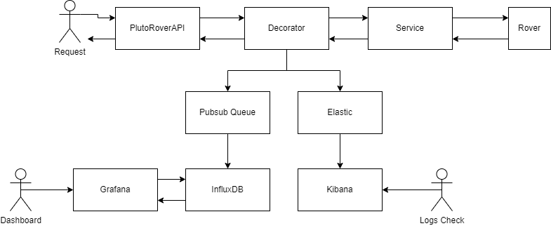

# PlutoRoverAPI

This is my approach to the PlutoRoverAPI. 

The structure I followed is a solution with one Aplication project and one Test Project, and the classes separated in folders.

In the Application Project, I have separated the structure as follows
- Controllers
- Helpers
- Infrastructure: Contains Base methods, Decorators, Pubsub and Exceptions
- Models: The Common models could be extracted in a different project / Nuget, but for the simplicity of the test, I've let them here.
- Services
- Startups: Configuring service dependencies

In the test project there's one file for each Service/Class Tested.

For getting the Rover Position, I've assumed the Rover will have this information, for test usages, I've decided that the position is a random position each time we launch the application.

### Architecture
For the Architecture Design I take in consideration two points.
 - We need a way to store logs of the traffic in the application and to be able to check errors.
 
For this I've decided to store at ElasticSearch logs of all the transactions the PlutoRoverAPI receives. This elastic will be could hosted and will have a Kibana to check the logs. Probably I would add a Kibana Dashboard to check the number of Requests / Errors.

 - We need a way to view transactions for all users in real time, and view metrics for different position requests.

For this I've decided to use a Graphana with an InfluxDB. The InfluxDB gives us the ability to see the metrics in real time and by configuring dashboards, they could be seen by any user.

I've decided to store this metrics from a PubSub queue to ensure the data always gets through. 

The Pubsub / ElasticSearch are just implemented in a Dummy way, but it shows the idea.

The flow of the Applications goes as follows:

